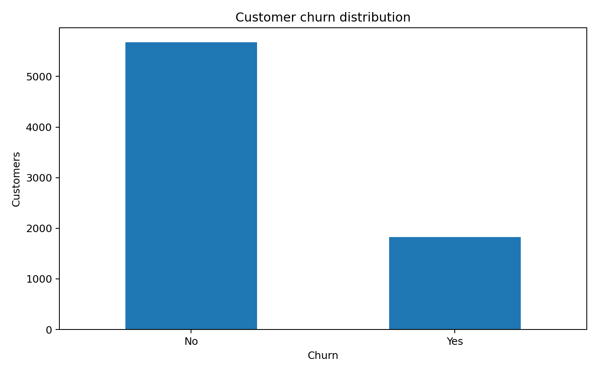
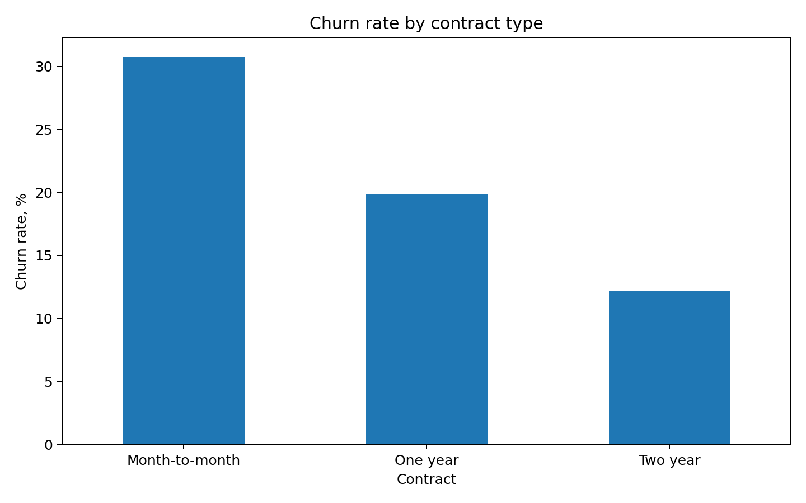
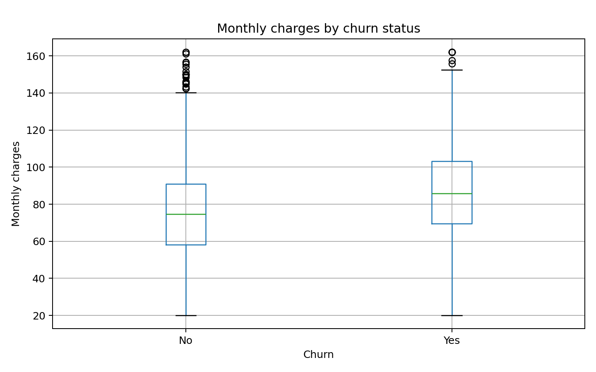
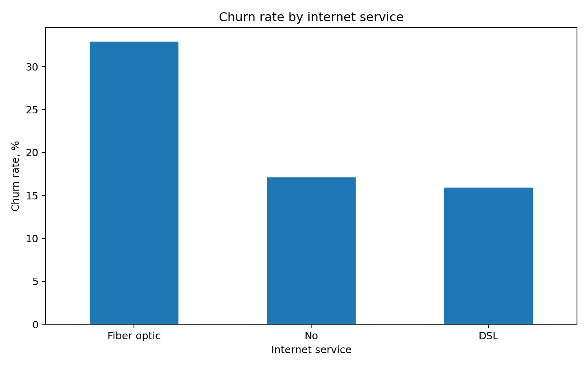
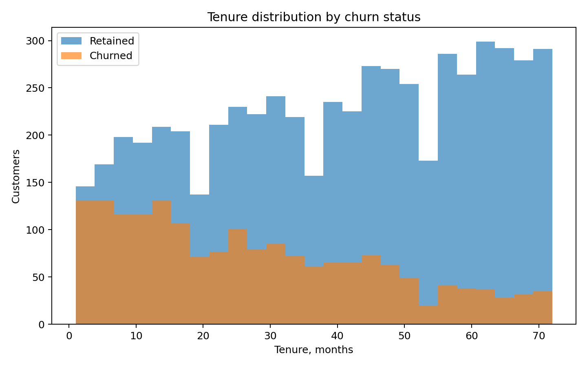
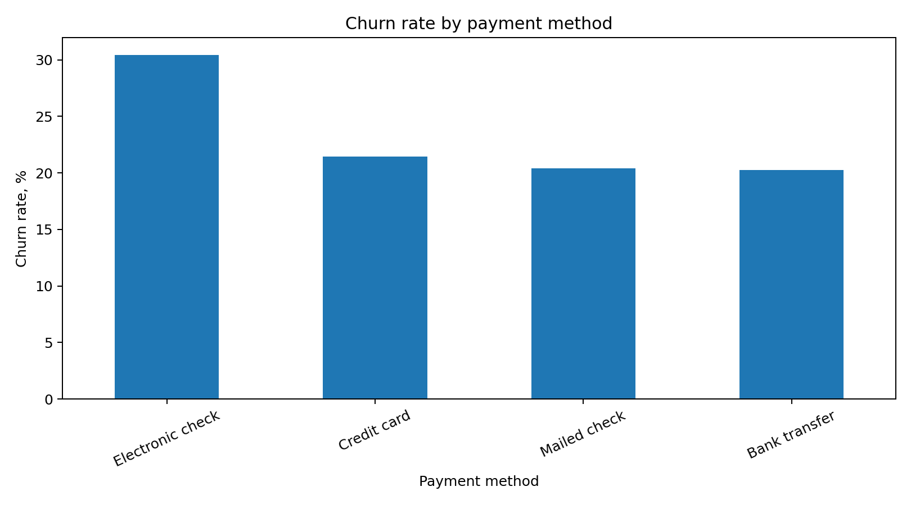

# Customer Churn Analysis

Анализ факторов оттока клиентов с использованием Python, pandas и статистических методов.

> **Данные синтетические.** Проект создан как портфолио и демонстрирует полный аналитический workflow от очистки данных до статистических выводов.

## Цель

Определить, какие характеристики клиентов связаны с оттоком, проверить наблюдаемые зависимости статистически и сформулировать выводы, которые потенциально могут быть полезны для удержания клиентов.

## Стек

- Python
- pandas / NumPy
- SciPy
- Matplotlib / Seaborn
- Jupyter Notebook

## Dataset

Исходный датасет содержит **7 535 строк**, включая намеренно добавленные пропуски и дубликаты.

Основные признаки:

- `customer_id` — идентификатор клиента;
- `age` — возраст;
- `tenure_months` — длительность обслуживания;
- `contract` — тип контракта;
- `internet_service` — тип интернет-сервиса;
- `payment_method` — способ оплаты;
- `monthly_charges` — ежемесячные начисления;
- `total_charges` — общая сумма начислений;
- `churn` — факт оттока.

## Аналитический pipeline

```text
Raw data
   ↓
Data quality check
   ↓
Missing values + duplicates
   ↓
Cleaning & transformation
   ↓
EDA
   ↓
Hypothesis testing
   ↓
Business interpretation
```

## Очистка данных

В процессе подготовки:

- проверены пропуски;
- удалены дубликаты;
- числовые пропуски обработаны медианными значениями;
- категориальные признаки приведены к единому виду;
- создан бинарный признак `churn_flag`.

После очистки осталось **7 500 уникальных наблюдений**.

## EDA

### Распределение churn



### Churn по типу контракта



Наибольший уровень оттока наблюдается у клиентов с контрактом **Month-to-month — 30.75%**. Для One year показатель составляет 19.82%, для Two year — 12.21%.

### Monthly charges



Группы churned и retained отличаются по распределению ежемесячных начислений.

### Churn по интернет-сервису



### Стаж клиентов



### Churn по способу оплаты



## Проверка гипотез

### 1. Тип контракта и churn

**H₀:** тип контракта и факт оттока независимы.

**H₁:** между типом контракта и churn существует статистически значимая связь.

Использован **Chi-square test of independence**.

Результат:

```text
p-value = 7.60 × 10⁻⁵¹
```

На уровне значимости 0.05 нулевая гипотеза отвергается.

**Вывод:** в синтетическом датасете тип контракта статистически связан с вероятностью churn.

### 2. Monthly charges и churn

Сравнивались распределения `monthly_charges` для клиентов, ушедших и оставшихся.

Использован **Mann–Whitney U test**, поскольку сравниваются две независимые группы без необходимости предполагать нормальность распределения.

```text
p-value = 2.45 × 10⁻⁶²
```

**Вывод:** различия между группами статистически значимы.

## Ключевые выводы

1. Клиенты с помесячным контрактом имеют самый высокий churn.
2. Тип контракта статистически связан с оттоком.
3. У churned и retained клиентов различается распределение monthly charges.
4. При интерпретации результатов важно отделять статистическую связь от причинно-следственной зависимости.

## Ограничения

- данные синтетические;
- результаты нельзя переносить на реальный бизнес без проверки на реальных данных;
- статистическая связь не доказывает причинность;
- для реального проекта потребовались бы дополнительные признаки и временной анализ.

## Запуск

```bash
pip install -r requirements.txt
python src/analysis.py
```

Также доступен интерактивный ноутбук:

```text
notebooks/churn_analysis.ipynb
```

## Что можно улучшить

Следующий этап проекта:

- построить baseline-модель вероятности churn;
- добавить ROC-AUC / PR-AUC;
- провести feature importance;
- проверить устойчивость результатов на train/test split;
- добавить сегментацию клиентов.
